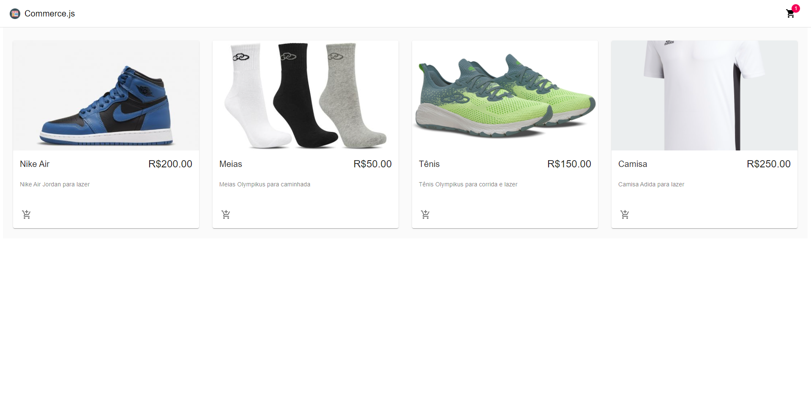
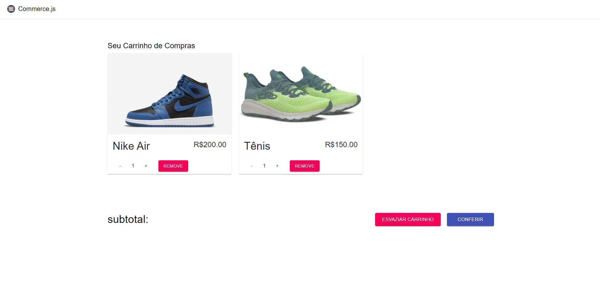
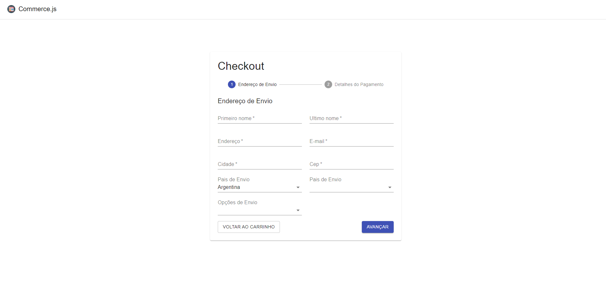
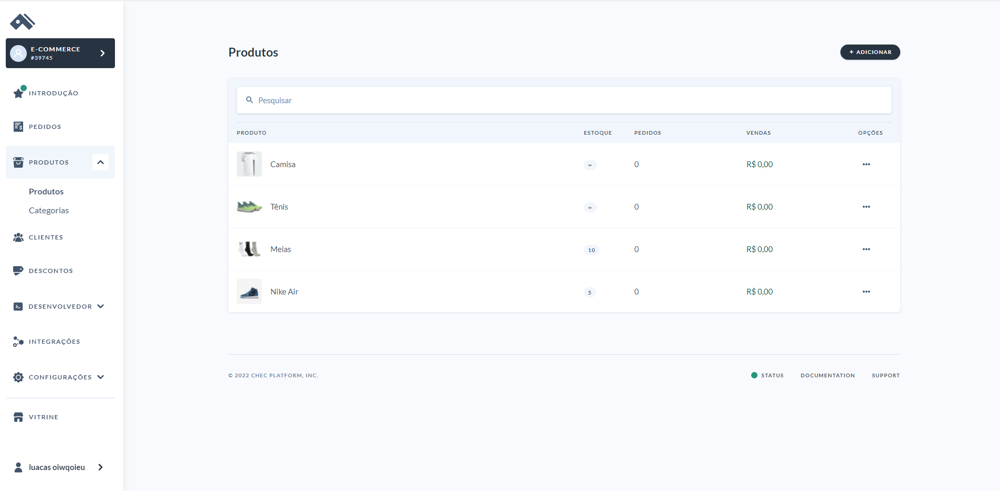

### 🚩 O desafio

Criar aplicaçao E-Commerce de vendas para qualquer produto.

A aplicação pode ser desenvolvida utilizando um framework/bilioteca front-end.

## 🛠 Tecnologias utilizadas

- ⚛️ **React** — Single page application
- ⚛️ **react-router-dom** - Roteamento de rotas
- ⚛️ **Context-Api** - Contexto das aplicações
- 💅 **Material-Ui** — Estilização dos componente
- 📡 **Axios** — Requisições a API
- 📡 **Chec/Commerce** - Lib para cadastro de produtos

## 🚀 Rodando o projeto

### Pré-requisitos

- Git
- NodeJS
- Yarn

### 🖥 Rodando a aplicação

Clone o repositório
Cadastre-se em https://commercejs.com/ e relacione seu banco de produtos alterando suas Keys

# Instala as dependências
npm install

# Inicia a aplicação
yarn start

# Imagem da tela inicial da Aplicacao

 

# Imagem da tela do Carrinho de Cmpra

 

# Imagem da tela de Checkout

 

# Imagem da tela de Cadastro de Produtos

 